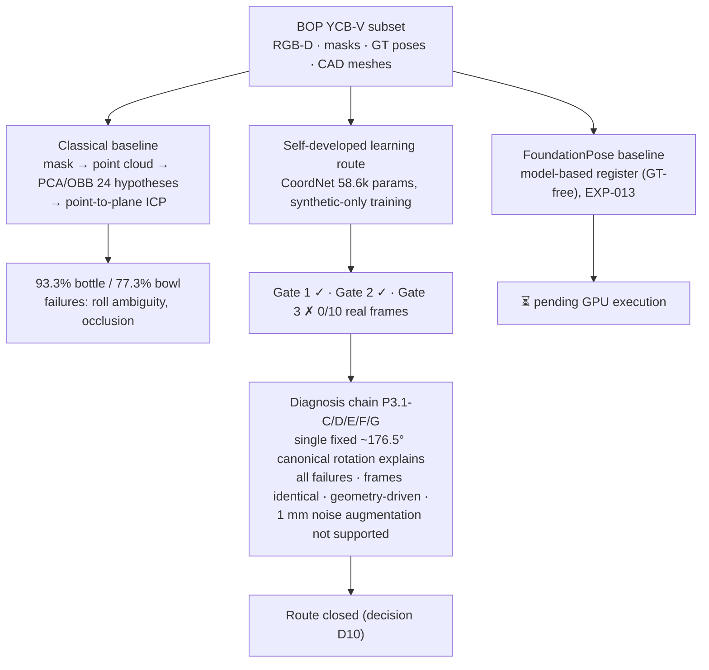
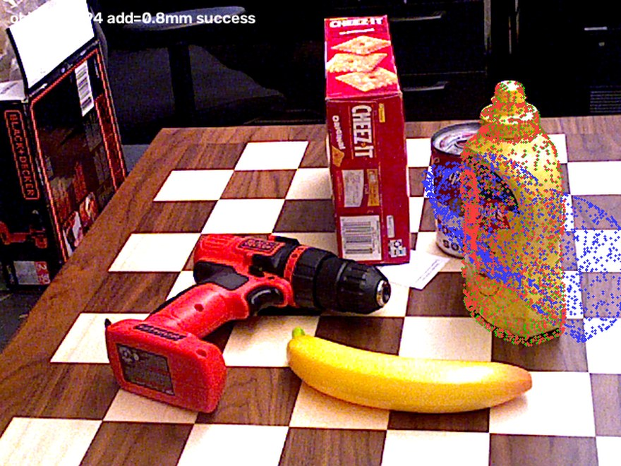
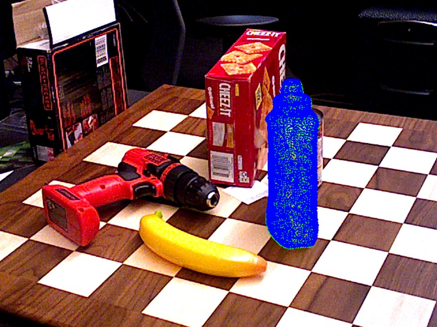
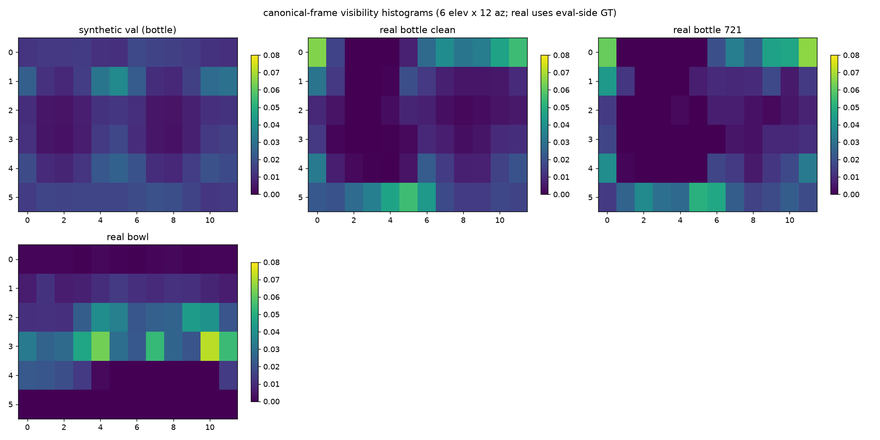
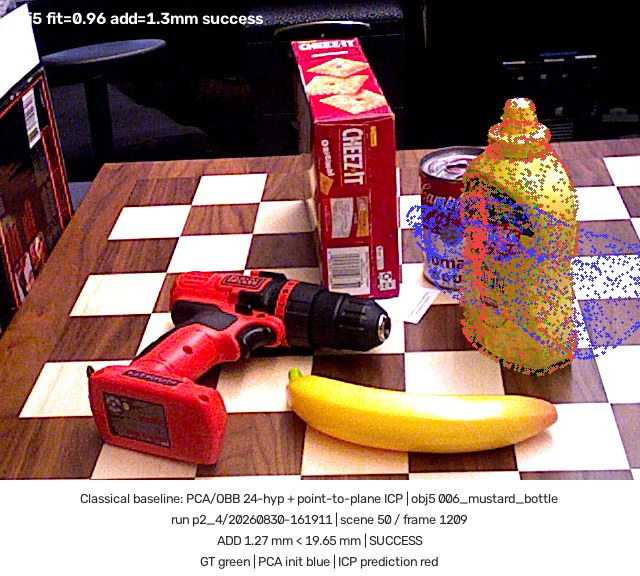
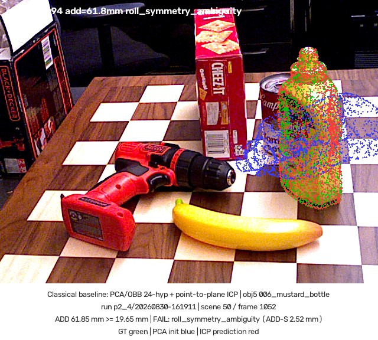
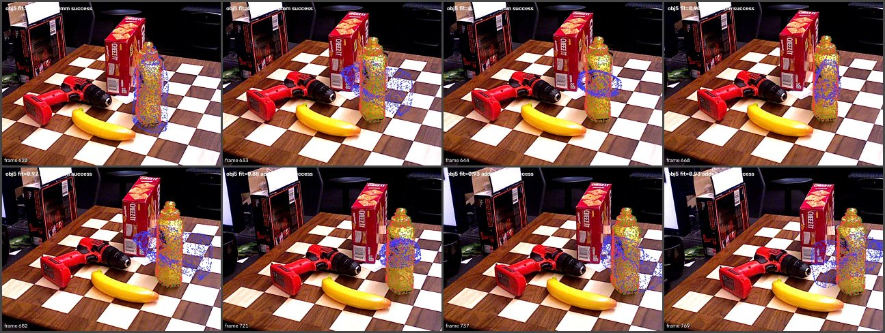

# robot-3d-perception

**A reproducible robot 3D perception research project for 6D object pose estimation —
with controlled baselines, systematic failure analysis, and a FoundationPose integration path.**

Given an RGB-D frame, estimate the SE(3) pose (rotation `R` + translation `t`) of a target
object and transform it into the robot coordinate frame. The project pairs a validated
classical geometry baseline with a *failure-driven* diagnosis of a self-developed learning
route, and is integrating FoundationPose as a strong model-based reference baseline.

## Current Status

| Phase | Scope | Status |
| --- | --- | --- |
| Phase 0 | Infrastructure (data interface, config, logging, evaluation, tests) | ✅ complete |
| Phase 1 | BOP YCB-V data subset (validated GT / masks / depth / models) | ✅ complete |
| Phase 2 | Classical geometry baseline (PCA/OBB + point-to-plane ICP) | ✅ complete |
| Phase 3 | Self-developed learning route | ✅ **closed after Gate 3 NO-GO + full diagnosis chain (P3.1-C/D/E/F/G)** |
| Phase 4 | FoundationPose integration | ✅ local integration complete · ⏳ runtime waiting for GPU machine |
| Phase 5 | Robustness / failure analysis | ⏳ planned |
| Phase 6 | Engineering packaging | ⏳ planned |

## Why This Project

Not "train a bigger model" — the project is built around **route decisions driven by
experimental evidence**. Every baseline runs under the same frozen evaluation protocol
(same frames, same metrics, same thresholds, oracle mask as a *declared controlled
condition*), and every failure gets a diagnosis before the route moves on.

## Pipeline



## Key Results

All numbers come from the frozen evaluation protocol: BOP YCB-V `test_bop19` subset,
scenes 50/53, 75 frames per object, **oracle `mask_visib`** (declared controlled condition),
success = `ADD(-S) < 0.1 × diameter`.

### Classical / Geometry Baseline (PCA/OBB + point-to-plane ICP)

| Object | Metric | Solver | Pose Success | Error (successful frames) |
| --- | --- | ---: | ---: | --- |
| 006_mustard_bottle (asymmetric) | ADD < 0.1d = 19.65 mm | 75/75 | **70/75 = 93.3%** | ADD median **1.30 mm**, max 2.01 mm |
| 024_bowl (rotationally symmetric) | ADD-S < 0.1d = 16.19 mm | 59/75 | **58/75 = 77.3%** | ADD-S median **2.67 mm**, max 3.19 mm |

Known failure modes: bottle **roll ambiguity** (5 frames — geometrically valid fit rotated
along the near-symmetric axis); bowl **heavy occlusion** (16 frames — insufficient visible
surface for ICP convergence). Full record: `EXPERIMENT_LOG.md` EXP-005/006.



### Phase 3 Diagnostic Results (self-developed learning route — closed)

A minimal PointNet-style canonical-correspondence network (58.6k params) trained purely on
synthetic renders:

| Gate | Result |
| --- | --- |
| Gate 1 — overfit sanity (synthetic) | ✅ PASS (train ADD 4.8 mm) |
| Gate 2 — synthetic validation (50 unseen poses) | ✅ PASS (val ADD 5.8 mm, train/val ratio 1.21) |
| Gate 3 — real YCB-V smoke (10 frames) | ❌ **0/10** |

The diagnosis chain that followed localized the failure precisely
(`EXPERIMENT_LOG.md` EXP-008–012, reports in `docs/`):

- **P3.1-C**: one fixed canonical rotation (−176.5° about the model Y axis) restores
  **10/10 poses to ~1–2 mm** — the failure is a single low-dimensional defect.
- **P3.1-D**: synthetic canonical frame and BOP model frame are **identical** (Kabsch ≈
  identity) — not a data convention bug.
- **P3.1-E**: destroying point-wise RGB does not remove the bias — it is
  **geometry-pathway-driven**; appearance explanations refuted.
- **P3.1-F**: clean real frames are *near-in-distribution* (NN domain gap ≈ 1 mm noise
  level) yet still flip — an **orientation-margin failure**, distinct from the
  severe-OOD collapse seen on the untrained bowl object.
- **P3.1-G**: real high-frequency depth noise is σ ≈ 0.26–0.40 mm, so "1 mm augmentation"
  is not supported; the route was closed **before** training (pre-registered stop).



### FoundationPose (model-based reference baseline)

Local integration complete (adapter, evaluation wrapper, frozen EXP-013 config, mock
pipeline verified end-to-end, 3090 runner with environment gating). Runtime execution is
**pending GPU machine availability** — no results exist yet and none are claimed.



### Multi-Object Baseline — EXP-014 initial → EXP-015 expanded (frozen)

The same frozen classical baseline (identical parameters, oracle mask, ADD(-S) < 0.1d)
over the 7-object evaluation set. The five coverage complements were first evaluated on
a 10-frame deterministic sample (EXP-014), then expanded to **full-scene coverage
(75 frames each, no frame dropped)** in EXP-015 — matching the anchors' historical
75-frame coverage. **The baseline evaluation is now frozen** (parameters fingerprinted;
any change requires a new experiment). Error medians follow the EXP-006 convention
(all frames that produced a pose, gate failures included).

| Obj | Name | Source | Total | Attempted | Success | med ADD / ADD-S |
| --- | --- | --- | ---: | ---: | ---: | ---: |
| 5 | mustard_bottle | historical (EXP-006) | 75 | 75 | 70/75 = 93.3% | 1.30 / 1.21 mm |
| 13 | bowl | historical (EXP-006) | 75 | 75 | 58/75 = 77.3% | 94.57 / **2.67** mm (ADD-S) |
| 2 | cracker_box | EXP-015 | 75 | 75 | 33/75 = 44.0% | 120.09 / 4.18 mm (roll flips ×42) |
| 6 | tuna_fish_can | EXP-015 | 75 | **0** | **0/75** | – (pre-solver point-cloud floor) |
| 10 | banana | EXP-015 | 75 | 62 | 59/75 = 78.7% (95.2% conditional) | 2.44 / 1.53 mm |
| 14 | mug | EXP-015 | 75 | 62 | **0/75** | 178.50 / 133.09 mm |
| 15 | power_drill | EXP-015 | 75 | 75 | **75/75 = 100%** | 1.15 / 1.11 mm |

*Attempted = frames that entered the solver; pre-solver `insufficient_observation`
rejections are not attempts; `icp_no_converge` frames ran PCA+ICP and count as
attempted. Full semantics: `docs/BASELINE_OPERATING_ENVELOPE.md`.*

Documented operating envelope (frozen, zero tuning; three failure regimes): **(A)
symmetry ambiguity** dominates near-symmetric objects (box flips 42/75 — the decisive
variable is symmetry, not size/texture; bottle roll ×5), **(B) pre-solver insufficient
observation** on small flat objects (tuna can: attempted = 0 at 10 and at 75 frames),
**(C) ICP non-convergence** on low-texture concave surfaces (mug 0/75 pose). Strengths:
complex textured mechanisms (drill 100%) and elongated asymmetric objects (banana,
95.2% conditional). The EXP-014 → EXP-015 comparison kept every failure-tag set
unchanged. These boundaries motivate the model-based comparison (EXP-013, pending 3090).
Full record: `EXPERIMENT_LOG.md` EXP-014/015 · table: `outputs/w2_4/unified_table.md`
· comparison: `outputs/w2_4/w2_3_vs_w2_4_comparison.md` · envelope:
`docs/BASELINE_OPERATING_ENVELOPE.md` (incl. freeze record §6).

## Demo Artifacts

Presentation-layer demos composed **read-only** from the frozen EXP-006 (P2.4)
per-frame outputs — no poses recomputed, no metrics touched
(`python scripts/build_demo.py --experiment p2_4 --object 5 ...`):

| Success (frame 1209, ADD 1.27 mm) | Failure (frame 1052, roll ambiguity) |
| --- | --- |
|  |  |



GT = green, PCA init = blue, ICP prediction = red. The 23-frame sequence
(scene 50, frames 620–769, all successful) is assembled into an MP4 from the
stored per-frame overlays (local artifact under `outputs/demo/`, gitignored).
Every build is gated by a GT-overlay convention check: the projected GT pose
must land on `mask_visib` (measured 0.92–0.95), guarding units and coordinate
conventions. The failure case shows the declared `roll_symmetry_ambiguity`
mode — ADD-S 2.52 mm (surface fits) but ADD 61.85 mm (flipped about the
bottle's near-symmetric axis) — failure analysis on display, not hidden error.

## Dataset & Evaluation

- **Data**: BOP YCB-V `test_bop19` minimal subset (12 scenes, 900 RGB-D frames, 21 textured
  models) — local, validated, read-only. Details: `docs/phase1_data_validation_report.md`.
- **Metrics**: ADD / ADD-S / translation / rotation error via one shared implementation
  (`r3p.evaluation.metrics.compute_all`) used by *every* method.
- **Evaluation object set (W2-2)**: 7 objects selected for geometry / appearance / symmetry
  coverage — anchors obj5 `006_mustard_bottle` (asymmetric → ADD) and obj13 `024_bowl`
  (rotationally symmetric → ADD-S), evaluated in EXP-006, plus obj2 / obj6 / obj10 / obj14 /
  obj15 evaluated in EXP-015 (**full-scene 75-frame coverage, frozen baseline**).
  Rationale: `docs/EVALUATION_OBJECT_SET.md` · registry: `configs/evaluation_objects.yaml`.
- **Controlled condition**: ground-truth `mask_visib` segmentation is used by all methods
  (oracle mask) — this isolates pose estimation from detection and is stated on every
  experiment record.

## Reproducibility

- Frozen per-experiment configs (`configs/`), fixed seeds, deterministic point-cloud
  ordering, single-thread ICP for bit-reproducible runs (decision D9).
- One-shot evaluation script per experiment; results (JSON/CSV/overlays) under
  `outputs/` (gitignored), summarized in `EXPERIMENT_LOG.md`.
- 103 tests (`pytest`), including synthetic regression tests, real-data contract tests,
  unit-conversion guards, and a structural GT-anti-leakage guard for the FoundationPose
  input manifest.

## Project Structure

```text
src/r3p/
  geometry/        pinhole model, SE(3), rotation representations
  datasets/        BOP YCB-V interface + synthetic scene generator
  pose/            classical baseline (PCA/OBB + ICP), SIFT+PnP (closed route),
                   rendered templates, learned CoordNet (closed route)
  evaluation/      ADD / ADD-S / translation / rotation + summary tables
  foundationpose/  project-side adapter, schemas, mock backend, EXP-013 config
  experiments/     one entry point per experiment
configs/           frozen per-experiment configs
docs/              per-experiment reports and audits
scripts/           dataset verification, diagnosis and FP runner scripts
tests/             103 tests (regression + real-data contracts)
```

## Current Scope & Limitations

Stated as current controlled scope and planned work — not as defects:

- **7-object evaluation set** (`docs/EVALUATION_OBJECT_SET.md`), **frozen**: anchors at
  full 75-frame coverage (EXP-006) and the five complements expanded to full-scene
  75-frame coverage (EXP-015); broader expansion is out of scope by freeze decision.
- **Oracle mask** for all pose methods: detection/segmentation is intentionally excluded
  to isolate the pose variable.
- **Controlled experiments** dominate so far: robustness perturbation studies
  (occlusion / depth noise) are Phase 5, not yet executed.
- FoundationPose runtime execution is **pending a GPU machine**; no FP numbers exist yet.
- The self-developed learning route is **closed** with a complete attribution chain; any
  restart would require a new approved design (orientation-anchor / equivariance work).

## 3-Minute Tour

1. This page — overview, status, pipeline.
2. [`docs/PROJECT_OVERVIEW.md`](docs/PROJECT_OVERVIEW.md) — the 2-screen version.
3. Key results above + `EXPERIMENT_LOG.md` (every experiment: question → hypothesis →
   setup → result → analysis → decision).
4. Decision **D10** in `PROJECT_CONTEXT.md` — why the self-developed route was closed and
   what replaced it.
5. `MODULE_MAP.md` — what every module does.

## Documentation Map

| File | Content |
| --- | --- |
| `PROJECT_OVERVIEW.md` | 2-screen overview for reviewers |
| `PROJECT_CONTEXT.md` | motivation, decisions (D1–D10), constraints |
| `PROJECT_SPEC.md` | phase plan, exit criteria, scope freeze |
| `EXPERIMENT_LOG.md` | EXP-000…012 records + experiment index |
| `MODULE_MAP.md` | module responsibilities |
| `CHANGELOG.md` | implementation history |
| `docs/PHASE4_PREFLIGHT.md` | FoundationPose audit & integration plan |
| `docs/P3_1_*.md`, `docs/P3_0_GATE3_DEBUG.md` | Phase 3 diagnosis reports |

## Next Step

Run **EXP-013** (FoundationPose feasibility, obj5 × 5 frozen frames) on the GPU machine —
project-side integration is complete and gated by
`scripts/foundationpose_env_check.py`; then Phase 5 robustness studies.

## License

Project license decision pending before any public release.
[FoundationPose](https://github.com/NVlabs/FoundationPose) is an **external dependency**
with its own license terms (NVIDIA Source Code License, non-commercial research use) and
is not redistributed from this repository.
