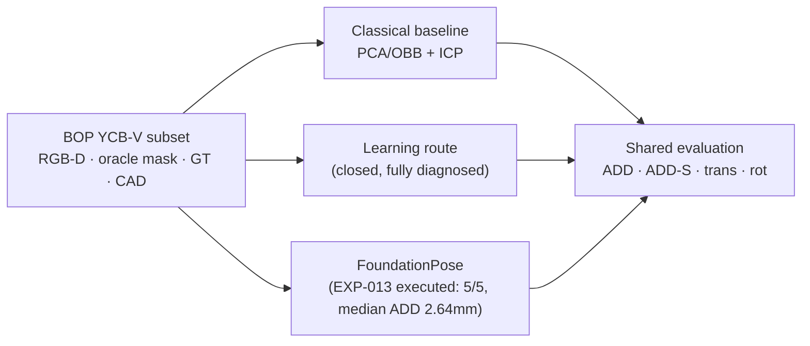

# PROJECT OVERVIEW

> The 2-screen version for reviewers and first-time visitors. Details live in the
> linked documents.

## Project Goal

Build a **reproducible robot 3D perception project** around 6D object pose estimation
from RGB-D input: estimate an object's SE(3) pose (rotation + translation) and relate it
to the robot frame — with controlled baselines, a shared frozen evaluation protocol, and
route decisions made by experimental evidence rather than by model count.

## Pipeline

## Major Findings

1. **Classical geometry works well under controlled conditions** — a mask → point cloud →
   PCA/OBB (24 proper-rotation hypotheses) → point-to-plane ICP pipeline reaches
   **93.3% pose success (ADD median 1.3 mm) on the bottle** and **77.3% (ADD-S median
   2.7 mm) on the bowl**, with failure modes that are systematic and explainable
   (roll ambiguity; heavy occlusion).
2. **A minimal learned correspondence network transfers to synthetic poses but not to the
   real domain** — and the real-domain failure is a **single fixed ~176.5° canonical
   rotation**: correcting it post-hoc recovers 10/10 poses to ~1–2 mm.
3. **The failure is not a data or pipeline bug** — the coordinate chain is verified by a
   closed-loop audit (4°/4 mm), the synthetic and BOP canonical frames are identical, the
   bias survives RGB ablation (geometry-driven), and 1 mm depth-noise augmentation is not
   supported by measured real sensor noise (σ ≈ 0.26–0.40 mm).
4. Therefore the self-developed learning route was **closed with a complete attribution
   chain** (decision D10) in favor of a mature model-based baseline.

## Current Results

| Route | Object | Metric | Success | Error (successful) | Source |
| --- | --- | --- | ---: | --- | --- |
| Classical + ICP | bottle | ADD < 0.1d | 70/75 = 93.3% | median 1.30 mm | EXP-006 |
| Classical + ICP | bowl | ADD-S < 0.1d | 58/75 = 77.3% | median 2.67 mm | EXP-006 |
| Self-developed learning | — | — | route closed | real 0/10; fixed-rotation recovery 10/10 | EXP-008/009 |
| FoundationPose | — | — | **5/5 = 100%** | — | EXP-013 |

Conditions: BOP YCB-V `test_bop19` subset, oracle `mask_visib`, frozen thresholds
(ADD / ADD-S < 0.1 × diameter), meters, shared metric implementation.

## Current Limitations

- 2 objects, one data subset; oracle segmentation (detection excluded by design);
  controlled experiments dominate — robustness perturbation studies are Phase 5.
- FoundationPose runtime execution pending a GPU machine; no FP results exist yet.
- The learned-route flip mechanism is localized (fixed canonical rotation,
  geometry-driven) but its root cause inside the network is not isolated.

## Current Phase & Next Step

Phase 4 (FoundationPose): **EXP-013 executed** (5/5, median ADD 2.64mm) — see Key
Results. Next: Phase 5 robustness and failure analysis across all baselines.

## If You Only Have 3 Minutes

1. This page. 2. The pipeline figure above. 3. The results table above.
4. Decision **D10** in `PROJECT_CONTEXT.md`. 5. `EXPERIMENT_LOG.md` (every experiment:
question → hypothesis → setup → result → analysis → decision).
